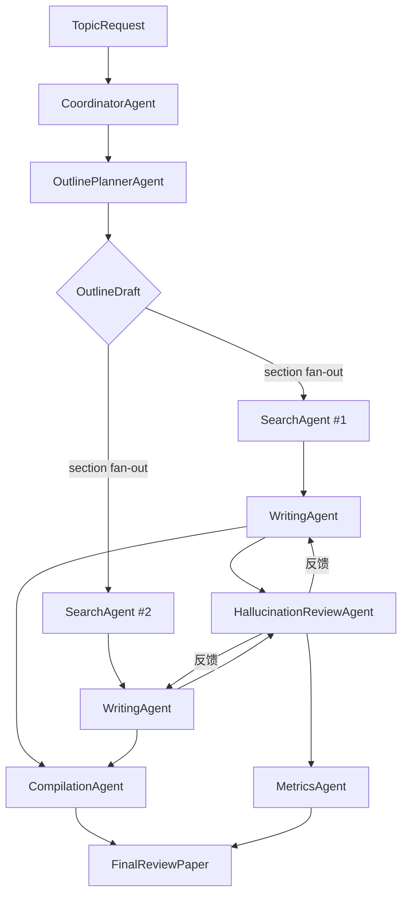

# 开发路线图（基于 AutoGen 0.4）

## 1. 系统角色设计

| 阶段 | 智能体 | 职责 | 关键输入 | 关键输出 | AutoGen 模式 |
| --- | --- | --- | --- | --- | --- |
| 协调 | CoordinatorAgent | 接收 Topic，初始化会话状态，调度后续角色 | `TopicRequest` | `OutlinePlanRequest`、任务派发 | Orchestrator Pattern |
| 大纲 | OutlinePlannerAgent | 生成全局综述大纲 | `OutlinePlanRequest`（包含 Topic 与约束） | `OutlineDraft`（分层结构 + 约束标签） | Reflection + Memory |
| 检索 | SearchAgent（可多实例） | 根据分配小节构造查询，访问 arXiv | `SearchTask`（含大纲上下文、子标题、历史缓存） | `PaperBundle`（含元数据、摘要、缓存 ID） | Parallel Fan-out |
| 撰写 | WritingAgent | 依据论文摘要撰写段落，严格按引用格式输出 | `WritingTask`（小节标题 + PaperBundle） | `SectionDraft`（段落 + 引用元数据） | Tool-augmented generation |
| 幻觉反馈 | HallucinationReviewAgent | 解析段落 claim，复核引用支持度 | `SectionDraft`、缓存摘要 | `ReviewReport`（分类统计、返工建议） | Critic Loop |
| 返工 | RevisionAgent（可与 WritingAgent 共享实现） | 根据反馈调整段落 | `RevisionTask`（原段落 + ReviewReport） | `SectionDraft`（修订版本） | Iterative Refinement |
| 汇总 | CompilationAgent | 合并所有段落与引用，生成最终文档 | `CompilationTask`（全部 SectionDraft） | `FinalReviewPaper`（正文 + References） | Aggregator |
| 评估 | MetricsAgent | 汇总幻觉指标，生成准确率报告 | `ReviewReport[]` | `HallucinationMetrics` | Monitoring |

## 2. 消息协议草案

- **TopicRequest**：`{ request_id, topic, constraints, preferred_sections }`
- **OutlineDraft**：`{ outline_id, sections: [ { id, title, objectives, dependencies } ], metadata }`
- **SearchTask**：`{ outline_id, section_id, title, context_outline, query_hints, cache_keys }`
- **PaperBundle**：`{ section_id, papers: [ { arxiv_id, title, authors, published, summary, pdf_url } ], cache_info }`
- **SectionDraft**：`{ section_id, paragraphs: [ { order, text, citations: [ { arxiv_id, span_range } ] } ], unresolved_feedback? }`
- **ReviewReport**：`{ section_id, claims: [ { text, arxiv_id, status, notes } ], summary: { supported, unsupported, invalid_metadata, accuracy } }`
- **CompilationTask**：`{ outline_id, sections: SectionDraft[], style_guide }`
- **FinalReviewPaper**：`{ outline_id, content, references: [ { arxiv_id, citation_text } ], metrics }`

所有消息类型需使用 `dataclass` 并与 `autogen_core` 的序列化机制兼容。

## 3. AutoGen 运行时规划

1. **选择运行时**：以 `SingleThreadedAgentRuntime` 为默认实现，预留切换至分布式的接口。
2. **注册流程**：通过 `AgentRuntime.register` 将各智能体绑定到唯一的 `AgentId`，必要时使用键区分会话。
3. **订阅策略**：
   - Coordinator 监听 `TopicRequest` 主题。
   - Outline Planner 与 Search Agents 使用 `TypeSubscription`，根据 `outline_id` 进行路由。
   - 使用 `TopicId` 的 `source` 字段区分会话，保证多租户隔离。
4. **中间件**：
   - 引入日志与调试中间件（参考 `MULTI_AGENT_SYSTEM_GUIDE.md` 第 9 章）。
   - 对外暴露 MetricsAgent 的结果供监控系统消费。

## 4. 工作流程概述

## 5. 开发阶段规划

1. **环境搭建**
   - 克隆 `microsoft/autogen`，阅读示例。
   - 建立虚拟环境，安装 AutoGen 0.4 及 arXiv API 所需依赖。
2. **基础设施**
   - 实现消息类型、缓存接口、日志框架。
   - 封装 LLM 调用与 arXiv 客户端。
3. **核心智能体**
   - 按角色顺序实现，先跑通单线程流程。
   - 搜索智能体应支持并发队列与限流策略。
4. **反馈与评估**
   - 实现幻觉反馈循环与 MetricsAgent。
   - 添加单元测试覆盖消息流与引用校验逻辑。
5. **扩展与部署**
   - 探索分布式运行时、持久化缓存、UI 接口。
   - 编写最终文档与示例剧本。

## 6. 验证清单

- [ ] 大纲生成遵循输入约束并可追踪来源。
- [ ] arXiv 检索日志包含查询语句与限流策略。
- [ ] 撰写智能体输出符合引用格式，并提供段落结构化数据。
- [ ] 幻觉反馈报告可计算准确率，触发返工流程。
- [ ] 最终汇总自动生成参考文献并排序。
- [ ] MetricsAgent 产出供外部监控消费的 JSON。

